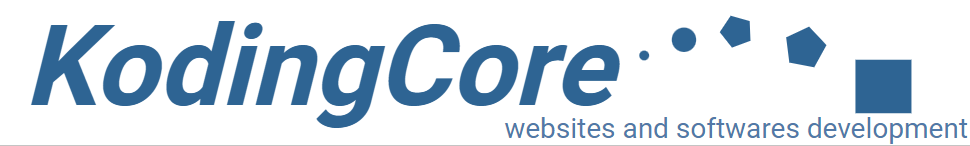

# soutenance

Site pour la soutenance à la 3WAcademy

Site web pour passer des commandes de créations de sites web, et entrer en relation avec l'entreprise de dévellopement web et logiciels, "KodingCore".

## Languages :

* PHP
  
* MYSQL
  
* Javascript
  
* HTML
  
* CSS (préprocesseur SASS)
  

## Fonctionnalitées:

* Inscription
  
* Commentaire
  
* Messagerie
  
* Dashboard Javascript généré par un Contrôleur d'API PHP, avec une section de recherche
  
* Possibilité de transmettre un formulaire de demande de site web
